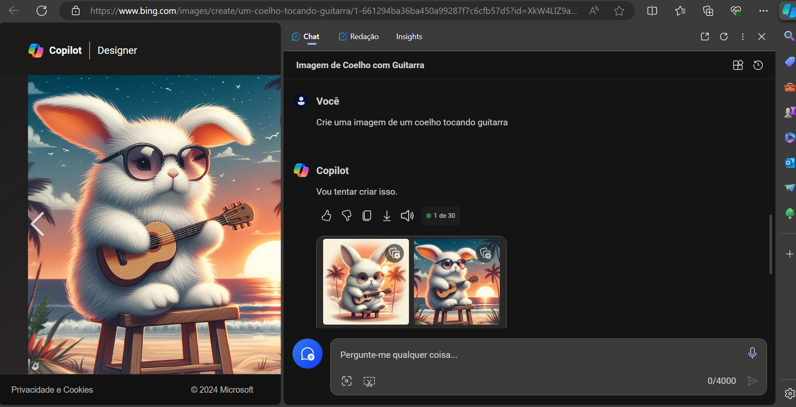
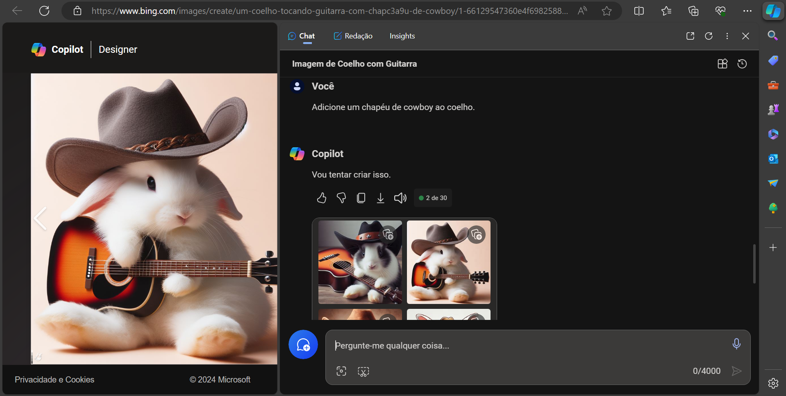
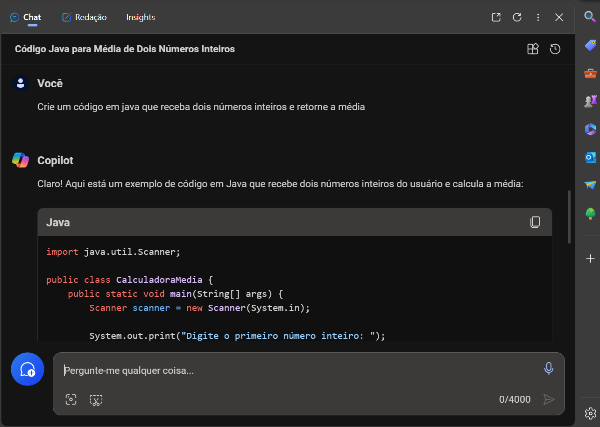

<h1>Explorando os Recursos de IA Generativa com Copilot e OpenAI</h1>

O Microsoft Copilot utiliza IA generativa para aprimorar os resultados de pesquisa do Bing. Ao contrário de uma pesquisa tradicional, que retorna conteúdo existente, o Copilot é capaz de criar novas respostas com base em contextos e informações disponíveis na web.

<h2>Experimentos</h2>
Pedi para o Copilot criar imagens de um coelho tocando guitarra.
 

 
Ainda dentro do contexto do coelho tocando guitarra, pedi para adicionar um chapéu de cowboy (sem precisar repetir os detalhes anteriores).
 

  
Em um novo contexto pedi para criar um método Java para calcular a média de dois números.
 

 
<pre>
import java.util.Scanner;

public class CalculadoraMedia {
    public static void main(String[] args) {
        Scanner scanner = new Scanner(System.in);

        System.out.print("Digite o primeiro número inteiro: ");
        int numero1 = scanner.nextInt();

        System.out.print("Digite o segundo número inteiro: ");
        int numero2 = scanner.nextInt();

        // Calcula a média
        double media = (numero1 + numero2) / 2.0;

        System.out.println("A média dos números é: " + media);

        scanner.close();
    }
}
</pre>
